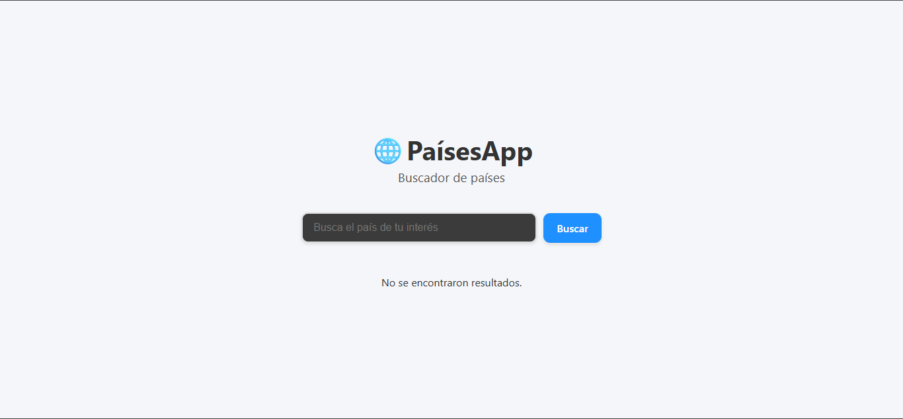
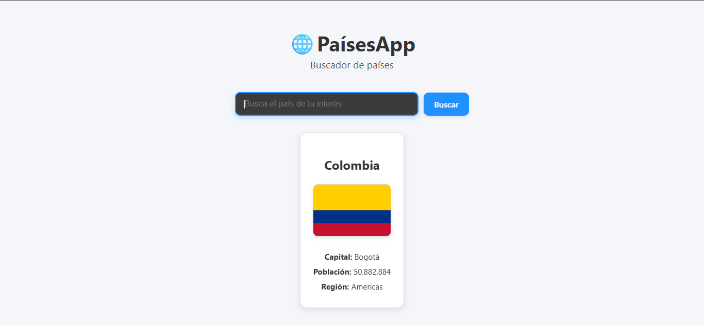

# 🌍 CountriesApp - Buscador de Países

Aplicación web desarrollada en **React + Vite** que permite buscar información de países consumiendo la API pública [REST Countries](https://restcountries.com/).  
El usuario puede buscar un país por nombre y visualizar la información en tarjetas con datos básicos.

---

## ✨ Características principales

- 🔎 Búsqueda de países por nombre.  
- 📄 Resultados mostrados en **tarjetas** con:  
  - Nombre del país  
  - Bandera  
  - Capital  
  - Población  
  - Región  
- ⚡ Manejo de **carga y errores** al consultar la API.  
- 🎨 Interfaz limpia y responsiva.  

---

## 📂 Estructura del proyecto

```bash
src/
├── components/
│   ├── Header.jsx         # Encabezado con título y descripción
│   ├── Search.jsx         # Barra de búsqueda (input + botón)
│   ├── CountryCard.jsx    # Tarjeta individual de país
├── Countries/
│   ├── CountriesList.jsx  # Lista de países renderizada con CountryCard
├── actions/
│   ├── getCountriesByName.js # Lógica para consumir la API REST Countries
├── App.jsx                # Componente principal con la lógica de estados
├── App.css                # Estilos principales
├── main.jsx               # Punto de entrada

```

---

## 🛠️ Tecnologías utilizadas

- ⚛️ React 18

- ⚡ Vite como bundler

- 🎨 CSS3 para estilos

- 🌐 Axios para llamadas HTTP

- ✅ PropTypes para validación de prop

---

## 🚀 Instalación y ejecución

- Clona este repositorio:

```bash
git clone https://github.com/asmejia28/Paises.git
```

- Accede al directorio:

```bash
cd Paises
```

- Instala las dependencias:

```bash
npm install
```

- Ejecuta la aplicación en modo desarrollo:

```bash
npm run dev
```

- Abre en tu navegador:

👉 http://localhost:5173/

---

## 📌 API utilizada

Endpoint principal:

```bash
https://restcountries.com/v3.1/name/{nombre}
```

Ejemplo:
https://restcountries.com/v3.1/name/colombia

---

## 📸 Capturas de pantalla

<p align="center">
  
  
</p>

---

## 👩‍💻 Autora

- Sofia Ocampo
🌐 GitHub: asmejia28

---

## 📄 Licencia

Este proyecto fue desarrollado con fines académicos 🎓.
Puedes usarlo y modificarlo libremente.